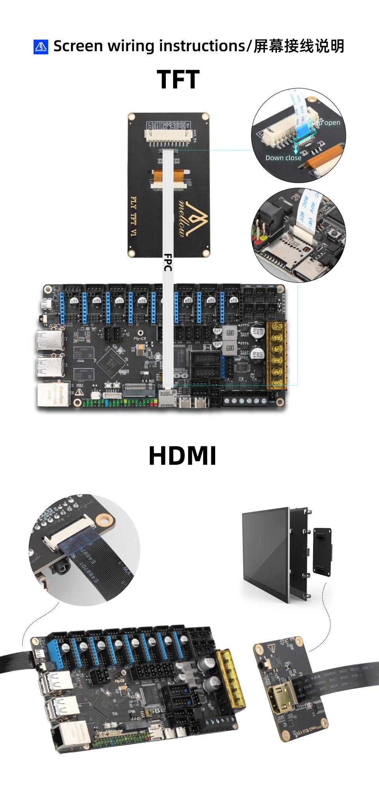

## 1. Klipperscreen的配置

> [!TIP] 浏览器打开你的IP:9999来访问FLY-Tools

<!-- tabs:start -->

### **HDMI**

* HDMI屏幕


### **TFT**

* TFT屏幕


<!-- tabs:end -->

>[!WARNING]
>通电前请注意屏线方向是否正确

## 2. CAN与klipperscreen导致超时的解决方法

>[!WARNING]
>如果搭配CAN工具板则有可能导致归位超时，只需执行下方命令即可

>[!WARNING]
>此操作可以解决归位超时，但是会修改Klipper源码，请慎重选择

```bash
sed -i 's/TRSYNC_TIMEOUT = 0.025/TRSYNC_TIMEOUT = 0.05/g' /home/fly/klipper/klippy/mcu.py 
sudo systemctl restart klipper
```

> [!WARNING]
> 如果更新了Klipper则可能会将源码修改回去

## 3. HDMI与TFT屏幕接线



## FLY TFT V2接线图

G2T+TFTV2使用方法请看这:[FLY_G2T](https://mellow.klipper.cn/#/board/fly_g2t/fly)

* 如果使用TFT V1接口需要在FLY Tools里面配置**fly-tft-v1**
* 如果使用TFT V2接口需要搭配G2T并且配置**fly-tft-v2**加上屏幕型号


