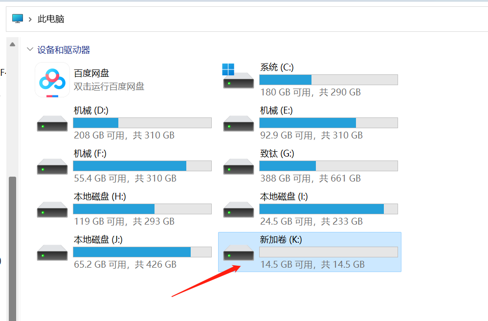

## 1 内存卡镜像烧录

1. 先安装好软件“balenaEtcher”，也可以用其他的(Win32DiskImager)等工具
2. SD卡插入读卡器，将读卡器插到电脑USB接口
3. 打开软件，点击“**Flash from file**”选择前面下载的系统镜像文件

4. 点击**“Select target**”选择SD卡，大小和SD卡容量差不多的就是，或进入资源管理器查看SD卡盘符

   

   5. 点击 “**Falsh**” ,出现进度条及“**Falshing…**”时开始写入系统镜像到SD卡。等待大约十多分钟，等待写入完成。

   5. 镜像烧录完成后，请配置 [FLY_Config](/board/fly_pi/FLY_π_fly_config.md "点击即可跳转")
   
   5. 如果烧录失败需要格式化SD卡后在烧录
   
      
   

## 2. 如何重新格式化SD卡

  如果写入失败或者需要重新刷写镜像时，请按如下操作：

  1. 点击“**此电脑**” 

  

  2. 再点击“**磁盘管理**”，找到刚刚插入的内存卡（可移动磁盘），选中后单击右键，点击“**删除卷**”，

  

  3. 单击右键再单击右键**“新建简单卷**”，新建分区请注意选择文件系统格式为**FAT32**，一直点下一步，直至完成，便将内存卡格式化为只有一个盘。
   
     当然也可以借助第三方工具来格式化内存卡和eMMC。

  

  

  

  4. 现在可以打开文件资源管理器，多出一个14.5G的U盘（16G eMMC显示大小为14.5G）
   
  5. 这样就可以直接用Win32diskimager或balenaEtcher来烧录系统镜像，盘符选择为这个14.5GU盘的盘符
   
  6. 镜像烧录完成后，请配置 [FLY_Config](/board/fly_pi/FLY_π_fly_config.md "点击即可跳转")

​      
