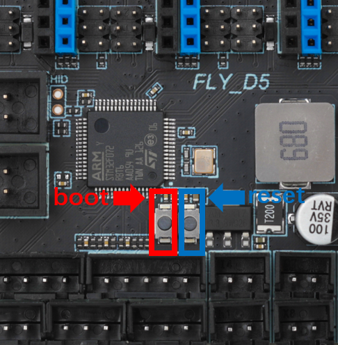
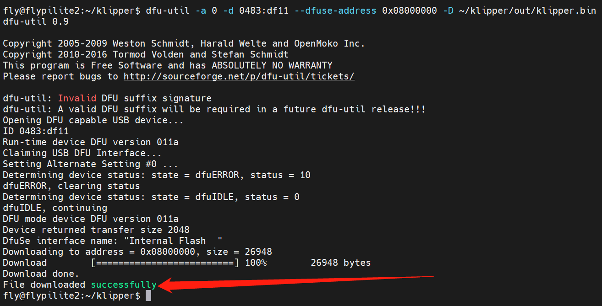

> [!TIP]
> FLY-DP5 需在断电状态下按住 **BOOT键** 后，使用Type-C数据线连接上位机，才能烧录固件

# 固件编译

请使用**MobaXterm_Personal**等**SSH工具**连接通过**WIFI**到您的上位机，并且需要确定以下几点

1. **请确保上位机安装好了Klipper服务**
2. **请确保登录的用户必须是安装好Klipper的用户**
3. **请确保你的输入法是英文**
4. **请确保你的上位机可以正常搜索到设备**
5. **请确保以上注意事项都做到，否则无法进行下一步**


# 1. 固件配置

**固件配置方法**

```
cd klipper
rm -rf .config && make menuconfig
```

<!-- tabs:start -->

### ****USB固件配置****


### ****USB桥接CAN固件配置****

* 此方法是桥接工具板的配置，请确保工具板CAN速率与上位机的CAN配置


<!-- tabs:end -->

* 执行命令下方命令来编译固件

```
make clean
make -j4
```


# 2. BOOT按键

>[!TIP]
>
>方法一：按住boot，将DP5主板接到上位机，然后松开BOOT
>
>方法二：按住boot，再按下reset按键，松开reset按键，最后松开boot按键




# 3. Klipper上位机烧录

1. 安装烧录工具

* FLY上位机无需执行安装烧录工具

```bash
sudo apt install dfu-util -y
```

2. 使用Type-C数据线将DP5主板连接到Linux设备
3. 执行下面的命令查看是否连接成功。

```bash
lsusb
```

* 如果没有DFU设备请重新执行第二步


4. 烧录固件(烧录前确保已经编译过固件)

```bash
cd && cd ~/klipper && make flash FLASH_DEVICE=0483:df11
```

5. 没有报错则烧录成功,如果出现报错请重新检查每个步骤操作



6. 出现上图内容则烧录成功

>[!Warning]
>
>烧录完成后，需要给D5主板彻底断电一次
