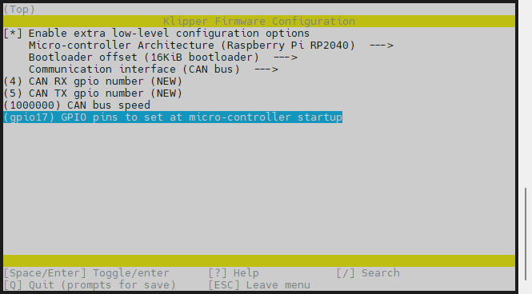

# 4. 固件烧录

> [!TIP]
> ERCF自带**CANBOOT**无需在编译烧录**CANBOOT**

> [!TIP]
> 已经识别到的CAN ID是不会被查找到的（即已经写入配置文件printer.cfg中的ID，连接成功并正常运行的，是不会被查找到的）

编译固件前请确保 [连接到SSH](/board/fly_pi/FLY_π_description5 "点击即可跳转")

确保使用最新的klipper！！！

1. 进入klipper目录并拉取最新的klipper
   
   ```bash
    cd ~/klipper && git pull
   ```
   
2. 修改klipper编译配置

    ```bash
    make menuconfig
    ```

**固件配置方法**


## 1. 配置固件

<!-- tabs:start -->

### **ERCF使用 CAN 连接的固件配置**

* 推荐·使用CAN连接如下图配置
  

### **ERCF使用 USB 连接的固件配置**

* USB连接如下图配置


  

<!-- tabs:end -->


----


## 2. 编译并烧录固件

* 编译

  ```bash
  make -j4
  ```

   使用**CanBoot**烧录时最后出现**Creating hex file out/klipper.uf2**则编译成功

   使用**USB**烧录时最后出现**Creating hex file out/klipper.bin**则编译成功
  
  
  
  <!-- tabs:start -->
  
  ### **使用CanBoot烧录固件**
  
  将下面命令中的``365f54003b9d``替换为[查找uuid](#_2-查找uuid "点击即可跳转")中查找到的uuid
  
  ```bash
  python3 ~/klipper/lib/canboot/flash_can.py -u 365f54003b9d
  ```
  
  如下图，出现``CAN Flash Success``则烧录成功
  
  
  
  ### **使用USB烧录固件**
  
  1. 查看是否连接到ERCF的BOOT烧录模式
  
     按住ERCF板的BOOT键，然后将usb连接到上位机
  
     
  
  ```bash
  lsusb
  ```
  
  执行上面的命令查看是否有 ``ID 2e8a:0003 Raspberry Pi RP2 Boot``这行，如没有请检查USB线(连接前记得按住BOOT键)
  
  
  
  2. 烧录
  
     ```bash
     cd ~/klipper/
     make flash FLASH_DEVICE=2e8a:0003
     ```
  
     执行上面的命令可能会提示输入密码，输入当前用户的密码就好，输密码的时候是不可见的。输完之接按回车
  
     出现下图则烧录成功
  
  

<!-- tabs:end -->


## 3. 检查

如果正确配置编译并烧录成功，则ERCF板的这个灯会常亮


<!-- tabs:end -->
