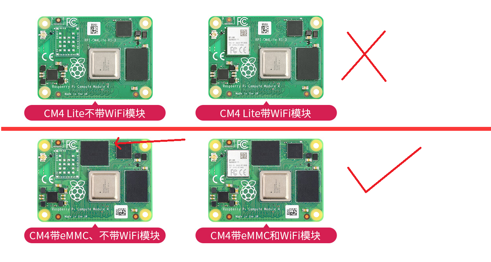
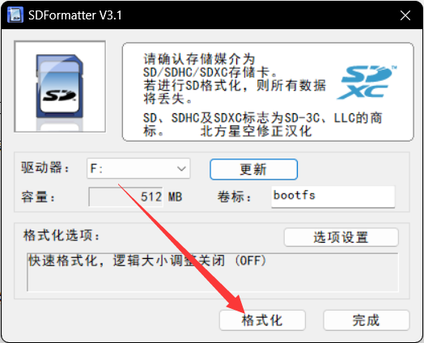

# 系统烧录

## 注意事项

1. 禁止带电时拔插除USB之外的任何设备
2. Type C 接口可以用作供电也可以用作USB SLAVE接口烧录镜像
3. 为了保证CM4供电正常，在使用Type C 接口烧录镜像时，请不要连接其他设备。
4. 模块没有带任何保护，请勿短路电源。
5. PRO_X10不支持POE功能

>[!Warning]
>
>- 注意：EMMC 版本不可以使用SD卡
>- 注意：不带EMMC版本使用MICRO SD 卡启动，需要使用读卡器烧录镜像

## 镜像下载

- 下载系统[（戳我下载）](https://www.raspberrypi.org/downloads/raspberry-pi-os/)下载最新发布的系统（或如图所示）。
- 如果下载的是种子文件，使用使用迅雷或彗星等软件再下载

- 带有桌面和推荐软件的镜像(Raspberry Pi OS with desktop and recommended software)，建议EMMC 16G 或者CM4 lite 16G内存卡以上的储存空间使用

>[!Warning]
>
>EMMC版本需要在断电情况下切换拨码进入CM4烧录模式，Lite直接烧录烧录镜像即可

## rpiboot（引导加载程序）下载

- 下载并以管理员权限打开软件rpiboot软件[（ 戳我下载)](https://files.waveshare.net/wiki/w/upload/f/f3/Rpiboot_setup.zip)
- 以安装驱动程序和启动工具。安装成功之后在安装目录下有一个rpiboot.exe的应用

## 进入烧录模式

作图两个拨码状态

将2号拨码往上拨后插上typec到电脑cm4进入烧录模式

往下拨则正常启动

* 此时连接电脑并且给主板供电，电脑设备管理器中会识别出一个BCMxxx的设备

* 然后运行rpiboot

* 等待运行结束，在我的电脑上面会出现一个U盘的盘符

> [!Warning]
>
> **注意：如果电脑没有识别出BCMxxx的设备 ，可能是上面哪一个步骤有问题。一定要识别出BCMxxx的设备运行rpiboot 才会有效，否则无效。**

## 格式化EMMC或者SD卡

* 使用SDFormatter.exe[（点击这里下载）](https://www.waveshare.net/w/upload/d/d7/Panasonic_SDFormatter.zip)软件格式化SD 卡

* 或者使用WIN自带的磁盘管理删除分区,删除分区之后重新建立分区即可。
* 此电脑右键 -> 管理 -> 磁盘管理 -> 找到新添加的盘符（选择错了就完蛋了） -> 删除所有分区 -> 建立一个分区（任意文件系统）如果是烧录过系统会有两个盘符，不要管直接格式化或者删除分区就好了

## 烧写镜像

1. 用Win32DiskImager.exe[（点这里下载）](https://www.waveshare.net/w/upload/7/76/Win32DiskImager.zip)烧写镜像。
2. 选择要烧写的镜像（步骤1下载的），点击“Write”进行烧写，烧录完成后，会提示你是否要格式化，这里需要点击取消

3. 烧录完毕之后，在我的电脑会识别出一个U盘的盘符

> [!Tip]
>
> 烧录完成后需要打开BOOT盘创建一个`ssh`的文件

## 烧录完成并重启

- 烧录完毕断开电源，断开和电脑的连接线，将BOOT拨码拨回去。重新上电即可