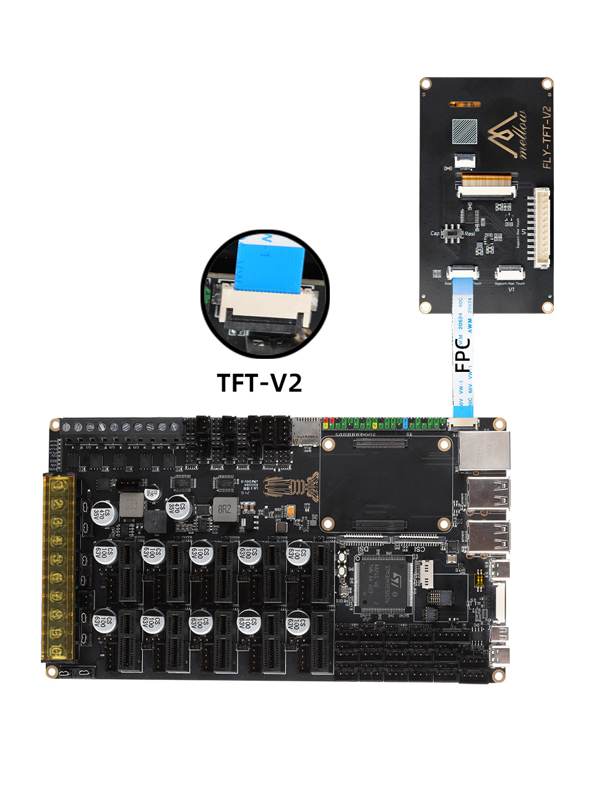

## 屏幕使用方法

Github地址:[FLY-TFT](https://github.com/kluoyun/FLY-TFT)

>[!Warning]
>
>请先安装KlipperScreen在安装TFT驱动


### 1. 介绍

FLY-TFT-V2是一款基于st7796的TFT液晶屏，支持电容触摸与电阻触摸两种，分辨率320x480，使用SPI接口

* 需要自行安装[KlipperScreen](https://klipperscreen.readthedocs.io/en/latest/Installation/)

### 2. 系统安装

> 注意：树莓派使用的系统内核版本必须大于`5.17.x`, 执行命令`uname -r`查看内核版本
>
> 请刷最新镜像比如`mainsailos`，不是升级内核

* 使用 [Raspberry Imager](https://www.raspberrypi.com/software/) 安装最新的 **MainsailOS**
    1. 下载并安装 [Raspberry Imager](https://www.raspberrypi.com/software/) 
    2. 打开**Raspberry Imager**
    3. 点击**CHOOSE DEVICE**
    4. 根据你的设备选择对应型号
    5. 点击**CHOOSE OS**
    6. 选择**Other specific-purpose OS**
    7. 选择**3D printing**
    8. 选择**Mainsail OS**
    9. 选择最新的版本。如果你的设置支持64位系统则选择**rpi64**
    10. 点击**CHOOSE STORAGE**
    11. 选择你的存储设备，比如SD卡
    12. 点击**NEXT**，等待安装完成

### 4. 驱动安装

1. 安装FLY-TFT-V2驱动
        ```bash
        git clone https://github.com/kluoyun/FLY-TFT.git
        cd FLY-TFT
        sudo chmod +x ./scripts/install.sh
        ./scripts/install.sh
        ```

### 5. 使用

> 触摸需要启用I2C支持，对应配置为`dtparam=i2c_arm=on`

1. 安装驱动后需要在config.txt文件中添加了 `dtoverlay=fly-tft-v2` 的覆盖层支持
2. 打开 `/boot/config.txt` (bookworm系统为`/boot/firmware/config.txt`)
    ```bash
    sudo nano /boot/config.txt
    ```
3. 在文件末尾添加下面的配置
   ```bash
    dtoverlay=fly-tft-v2
   ```
   * 默认屏幕为90度横屏显示，如果需要旋转屏幕请使用下面的配置
   ```bash
    dtoverlay=fly-tft-v2,r90  # 与默认方向一致，横向
    dtoverlay=fly-tft-v2,r270 # 270度横屏，横向(翻转)
    dtoverlay=fly-tft-v2,r0   # 0度竖屏，纵向
    dtoverlay=fly-tft-v2,r180 # 180度竖屏，纵向(翻转)
   ```
    * 只能添加任意一个配置，不能添加多个
    * 正常情况下，TFT的触摸方向会自动旋转跟随显示方向，无需修改系统内的触摸配置
4. 添加到文件末尾后，执行命令 `sudo reboot` 重启系统

* 请确保硬件连接正确
* 安装了驱动
* 在`/boot/config.txt` (bookworm系统为`/boot/firmware/config.txt`)文件中添加了`dtoverlay=fly-tft-v2` 的覆盖层支持
* 部分系统可能存在默认的fb0设备，FLY-TFT会被分配到fb1设备，需要修改配置文件使能fb1设备
* 执行命令`ls /dev/fb*`查看设备，如果出现两个设备fb0和fb1，请执行下面的命令将fb1设备使能（默认是fb0）
* 执行下面的命令修改默认配置为fb1设备
    ```bash
    sudo sed -i 's/\/dev\/fb0/\/dev\/fb1/g' /etc/X11/xorg.conf.d/99-fbdev.conf
    ```

### 6. 使用KlipperScreen

* MainsailOS默认没有安装KlipperScreen，需要手动安装
* 请参考[KlipperScreen](https://github.com/KlipperScreen/KlipperScreen)或使用[kiauh](https://github.com/dw-0/kiauh)安装
* 如果成功安装了KlipperScreen，且第5步骤已正确完成，此时应该已经显示了KlipperScreen界面

### 屏幕接线



