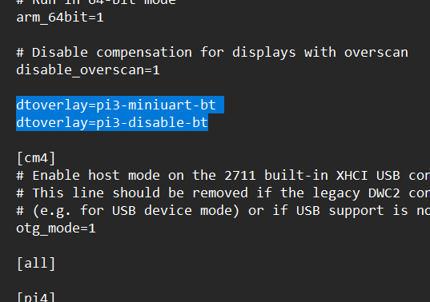

# 配合RPI3/4B使用

* 安装图


1. 烧录系统

* 建议使用mainsailos或者fluiddpi
* [MainsailOS 下载](https://github.com/mainsail-crew/MainsailOS/releases/latest)
* [MainsailOS 烧录教程](https://docs.mainsail.xyz/setup/mainsailos/pi-imager)
  
* [FluiddPi 下载](https://github.com/fluidd-core/FluiddPi/releases/latest)
* [FluiddPi 烧录教程](https://docs.fluidd.xyz/installation/fluiddpi)

> [!TIP]
> 烧录完成后请先不要启动系统，完成以下设置

> [!WARNING]
> 树莓派使用UART必须禁用蓝牙功能，请按照下面操作！！！


* 烧录好的SD卡在电脑中是一个boot磁盘


3. 打开其中的**config.txt**文件加入配置

    * 树莓派3B/4B添加此配置

    ```cfg
    dtoverlay=pi3-miniuart-bt
    dtoverlay=pi3-disable-bt
    ```

    

4. 打开其中的**cmdline.txt**文件删除里面的类似于**console=serial1,115200**字样内容(没有的话不用管)

5. 在boot磁盘下新建一个空白文件，文件名为**SSH**，没有后缀

    

6. 如果需要设置RPI连接WiFi请修改以下文件

    * MainsailOS修改**mainsailos-wpa-supplicant.txt**
    * FluiddPi修改**fluiddpi-wpa-supplicant.txt**
    * 删除这4行前面的#
    * 将ssid和psk分别修改为你的WiFi名及密码

    

7. 准备工作完成，现在可以将SD卡装到Puppet上电启动了

## 安装klipper RPI MCU

* 为了确保您能使用FLY-Puppet主板所有功能，请安装Linux mcu

1. 先使用终端工具连接到您的主板SSH
2. 安装脚本

    ```bash
    cd ~/klipper/
    sudo cp ./scripts/klipper-mcu.service /etc/systemd/system/
    sudo systemctl enable klipper-mcu.service

    ```

3. 配置固件

    ```bash
    cd ~/klipper/
    make menuconfig
    ```

    * 微控制器选择**Linux process**, 只修改这一项
    


4. 编译安装

    ```bash
    sudo service klipper stop
    make flash
    sudo service klipper start
    sudo usermod -a -G tty pi
    ```

## Klipper配置

* 浏览器打开[http://fluiddpi](http://fluiddpi) 或 [http://mainsailos](http://mainsailos) 或http://ip/

```cfg
[mcu]
serial: /dev/ttyAMA0
restart_method: command

[mcu host]
serial: /tmp/klipper_host_mcu
```

* 具体配置请参考[示例配置](/board/fly_puppet/cfg.md)
