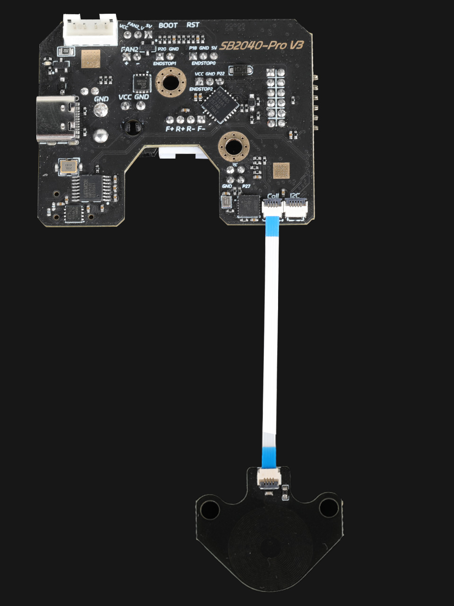

## 安装方法



>[!Tip]
>
>喷嘴碰热床后，线圈底部之于喷嘴的位置需至少在喷嘴上面 1-2 mm

## 拉取分支

**注意事项**

* 需要拉取分支
* 需要重新刷固件

```
cd klipper
git remote add eddy https://github.com/Arksine/klipper.git
git fetch eddy
git checkout eddy/dev-probe-drift-20240304
sudo systemctl restart klipper
```

* 拉取完成后重新刷固件即可
* 因网络问题可能会拉取失败，多拉取几次即可

## 使用板载1612参考配置

```
[probe_eddy_current fly_eddy_probe]
sensor_type: ldc1612
z_offset: 0.8
i2c_address: 43
i2c_mcu: SB2040
i2c_bus: i2c1b
x_offset: 0
y_offset: 0
speed:40
lift_speed: 5
```

## 使用外置1612参考配置

* 请注意目前没有出外置1612模块 此配置暂时用不了

```
[probe_eddy_current fly_eddy_probe]
sensor_type: ldc1612
z_offset: 0.8
i2c_address: 42
i2c_mcu: SB2040
i2c_bus: i2c1b
x_offset: 0
y_offset: 0
speed:40
lift_speed: 5
```

##  操作说明

* 请使用**FUIDD**网页添加下方配置后在执行后面操作

```
[force_move]
enable_force_move: true
```

* 在控制台输入下方命令后在请自行将打印头移动到热床中间

```cfg
SET_KINEMATIC_POSITION z=80
```

* 上述配置完成后，首先需要校准 Eddy 的驱动电流，然后**EDDY**到热床中央**20mm**高的位置。在 Mainsail 的 Console 执行下方命令自动获取电流，然后 SAVE_CONFIG 保存参数。正常应该是**16**左右如果是0或者30请检查接线。

```cfg
LDC_CALIBRATE_DRIVE_CURRENT CHIP=fly_eddy_probe
```

* 校准 Eddy 频率与 Z 轴高度的关系，先 home X 和 Y 轴

```
G28 X Y
```

* 然后将喷头移动到平台中心（注意：此步骤要确保机器没有加载 heightmap）

* 开始手动 z 偏移校准 **[Paper test](https://www.klipper3d.org/Bed_Level.html#the-paper-test)**:

```
PROBE_EDDY_CURRENT_CALIBRATE CHIP=fly_eddy_probe
```

* 校准完成后 SAVE_CONFIG 保存参数
* 带有 z_tilt 或者 quad_gantry_level（QGL）功能的打印机，先运行一次 **Z_TILT_ADJUST 或者 QUAD_GANTRY_LEVEL** ，防止网格扫描时喷嘴撞到热床
* 此命令是快速扫床指令 `BED_MESH_CALIBRATE METHOD=scan SCAN_MODE=rapid` 

## QGL使用扫描模式

* 如果是配置了**[quad_gantry_level]**可以添加下方配置，没有则不需要添加

```
[gcode_macro QUAD_GANTRY_LEVEL]   #随着龙门高低差降低降低探测高度
rename_existing: _QUAD_GANTRY_LEVEL
gcode:
    SAVE_GCODE_STATE NAME=STATE_QGL
    BED_MESH_CLEAR
    
      _QUAD_GANTRY_LEVEL horizontal_move_z=10 retry_tolerance=1
    
    _QUAD_GANTRY_LEVEL horizontal_move_z=2 METHOD=scan
    # G28 Z
    RESTORE_GCODE_STATE NAME=STATE_QGL
```
## z_tilt使用扫描模式

* 如果是配置了**[z_tilt]**可以添加下方配置，没有则不需要添加

```
[gcode_macro Z_TILT_ADJUST]
rename_existing: _Z_TILT_ADJUST
gcode:
    SAVE_GCODE_STATE NAME=STATE_Z_TILT
    BED_MESH_CLEAR
    
      _Z_TILT_ADJUST horizontal_move_z=10 retry_tolerance=1
    
    _Z_TILT_ADJUST horizontal_move_z=2 METHOD=scan
    # G28 Z
    RESTORE_GCODE_STATE NAME=STATE_Z_TILT
```

## 优化宏

>[!Tip]
>
>随着龙门高低差降低降低探测高度

## QGL使用扫描模式

* 如果是配置了 **[quad_gantry_level]** 可以添加下方配置，没有则不需要添加

```
[gcode_macro QUAD_GANTRY_LEVEL]
rename_existing: _QUAD_GANTRY_LEVEL
gcode:
    SAVE_GCODE_STATE NAME=STATE_QGL
    BED_MESH_CLEAR
    
      _QUAD_GANTRY_LEVEL horizontal_move_z=10 retry_tolerance=1
    
    _QUAD_GANTRY_LEVEL horizontal_move_z=2 METHOD=scan
    # G28 Z
    RESTORE_GCODE_STATE NAME=STATE_QGL
```
## z_tilt使用扫描模式

* 如果是配置了 **[z_tilt]** 可以添加下方配置，没有则不需要添加

```
[gcode_macro Z_TILT_ADJUST]
rename_existing: _Z_TILT_ADJUST
gcode:
    SAVE_GCODE_STATE NAME=STATE_Z_TILT
    BED_MESH_CLEAR
    
      _Z_TILT_ADJUST horizontal_move_z=10 retry_tolerance=1
    
    _Z_TILT_ADJUST horizontal_move_z=2 METHOD=scan
    # G28 Z
    RESTORE_GCODE_STATE NAME=STATE_Z_TILT
```

## 温度配置

```
[temperature_probe fly_probe]
sensor_type:Generic 3950
sensor_pin:SB2040:gpio28
```

## 线圈模型

```
https://cdn.mellow.klipper.cn/STEP/sen.step
https://cdn.mellow.klipper.cn/STEP/1612.step
```

