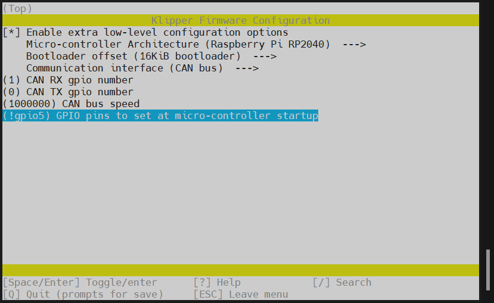
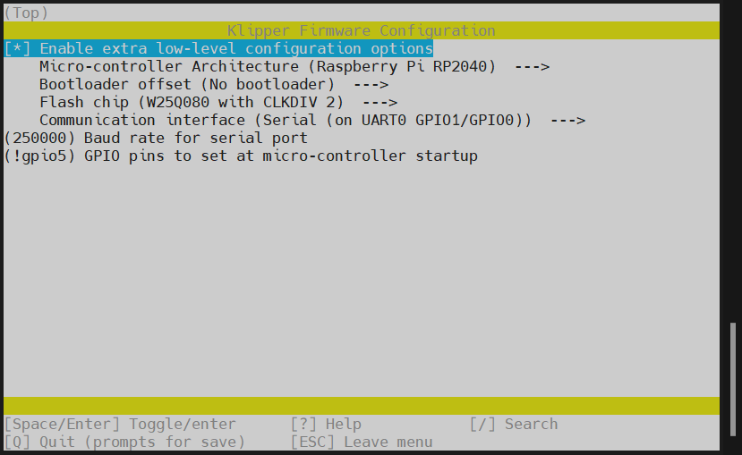
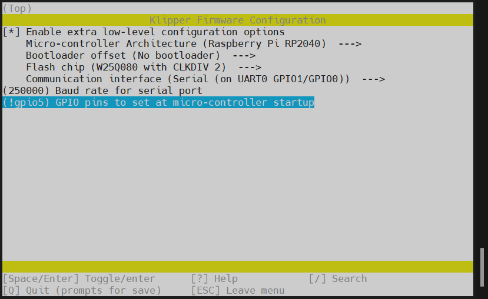
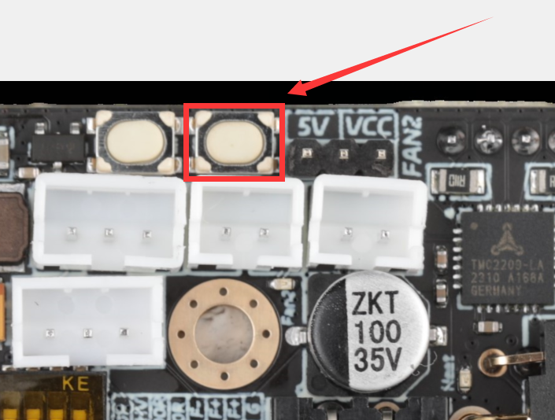
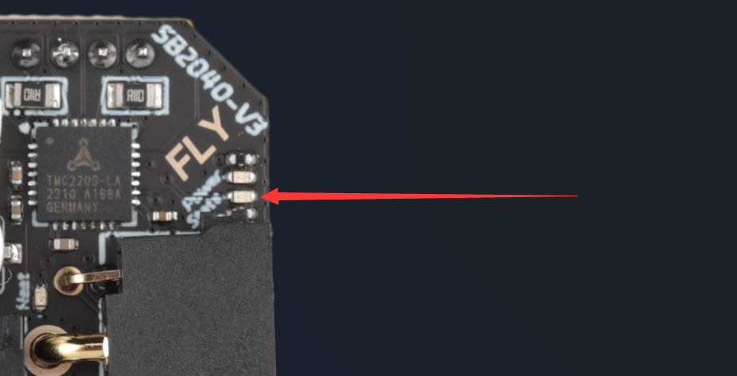

# 固件烧录

> [!Warning]
>
> 烧录固件之前确保已完成[上位机连接ssh](introduction/conntossh.md "点击即可跳转")文档
>
> SB2040 PRO V3预先安装了katapult固件并且使用CAN连接，速率为1M

# 编译Klipper固件

请使用**MobaXterm_Personal**等**SSH工具**连接通过**网络**到您的上位机，并且需要确定以下几点

1. **请确保上位机安装好了Klipper服务**
2. **请确保登录的用户必须是安装好Klipper的用户**
3. **请确保你的输入法是英文**
4. **请确保你的上位机可以正常搜索到设备**
5. **请确保以上注意事项都做到，否则无法进行下一步**


* 连接到SSH后输入下面的命令并回车：

     ```
     cd  && cd ~/klipper  && make clean && rm -rf .config && make menuconfig
     ```

* 现在应该出现了Klipper编译配置界面，**↑ ↓ 键**选择菜单，**回车键**确认或进入菜单

<!-- tabs:start -->

### ****CAN 固件配置****
>[!TIP]
>请确保工具板拨码拨到正确位置
>
>**烧录时候请确保工具板已经正常连接到UTOC或者刷好桥接固件的工具板上**


* 选择`[ ] Enable extra low-level configuration options`然后回车


* 选择`    Micro-controller Architecture (Atmega AVR)  --->`回车进去找到`( ) Raspberry Pi RP2040`然后回车


* 选择`    Bootloader offset (No bootloader)  --->`回车然后选择`( ) 16KiB bootloader`在回车


* 选择`    Communication interface (USB)  --->`回车然后选择`( ) CAN bus`回车


* 选择`(4) CAN RX gpio number (NEW)`将**4**改成**1**
* 选择`(5) CAN TX gpio number (NEW)`将**5**改成**0**


* `(1000000) CAN bus speed`为can速率默认为1M，不建议自己修改
* 选择`()  GPIO pins to set at micro-controller startup (NEW)`输入`!gpio5`然后回车
* 请注意 **!** 请使用英文输入法输入



* 输入`Q`保存然后输入`Y`退出即可编译固件
* 输入`make`即可编译固件
* 出现`  Creating bin file out/klipper.bin`代表本次编译固件成功


**CAN烧录方法**

> [!TIP]
> 请使用UTOC或者其他支持klipper USB桥接CAN的主板将SB2040-V3与上位机通过CAN总线连接

> [!TIP]
>
> 请先看[Id读取](http://mellow.klipper.cn/#/board/fly_sb2040_v3_pro/uuid?id=can-id读取)接好线与上位机连接后在搜索CAN ID

> [!TIP]
> 如果已经烧录过klipper并且在正常运行，可跳过查找uuid，使用配置文件中的uuid进行烧录

首先进入ssh，然后依次输入以下指令

```
~/klippy-env/bin/python ~/klipper/scripts/canbus_query.py can0
```


1. 将下面命令中的``c5d882v0d121``替换为[查找uuid](#_2-查找uuid "点击即可跳转")中查找到的uuid

```bash
python3 ~/klipper/lib/canboot/flash_can.py -u c5d882v0d121
```

2. 如下图，出现``CAN Flash Success``则烧录成功


* 如果需要更新固件只需要编译好固件后重新执行烧录指令就可以更新固件
* 请保证能找到ID或者KIPPER已经连接上

```
python3 ~/klipper/lib/canboot/flash_can.py -u  <MCU ID>
```


### ****RS232 固件配置****

>[!TIP]
>请确保工具板拨码拨到正确位置
>
>请注意因为RS232连接无法使用直接通过命令行重新进入SSH，只能通过USB更新固件



* 选择`[ ] Enable extra low-level configuration options`然后回车


* 选择`    Micro-controller Architecture (Atmega AVR)  --->`回车进去找到`( ) Raspberry Pi RP2040`然后回车


* 这一项`    Bootloader offset (No bootloader)  --->`不动
* 这一项`    Flash chip (W25Q080 with CLKDIV 2)  --->`不动

* 选择`    Communication interface (USB)  --->`回车然后选择`( ) Serial (on UART0 GPIO1/GPIO0)`回车


* 这一项为串口波特率。默认250K`(250000) Baud rate for serial port`不动

* 选择`()  GPIO pins to set at micro-controller startup (NEW)`输入`!gpio5`然后回车
* 请注意 **!** 请使用英文输入法输入



* 输入`Q`保存然后输入`Y`退出即可编译固件
* 输入`make`即可编译固件
* 出现`  Creating uf2 file out/klipper.uf2`代表本次编译固件成功


**USB烧录方法**

1. 按住SB2040板的BOOT键，然后将usb连接到上位机



```bash
lsusb
```

执行上面的命令查看是否有 ``ID 2e8a:0003 Raspberry Pi RP2 Boot``这行，如没有请检查USB线(连接前记得按住BOOT键)


2. 烧录
   
    ```bash
    cd ~/klipper/
    make flash FLASH_DEVICE=2e8a:0003
    ```
    

* 执行上面的命令可能会提示输入密码，输入当前用户的密码就好，输密码的时候是不可见的。输完之接按回车

   出现下图则烧录成功


<!-- tabs:end -->

### 确定固件烧录完成

* 如果固件刷完后此led会在微亮情况下变成常亮


