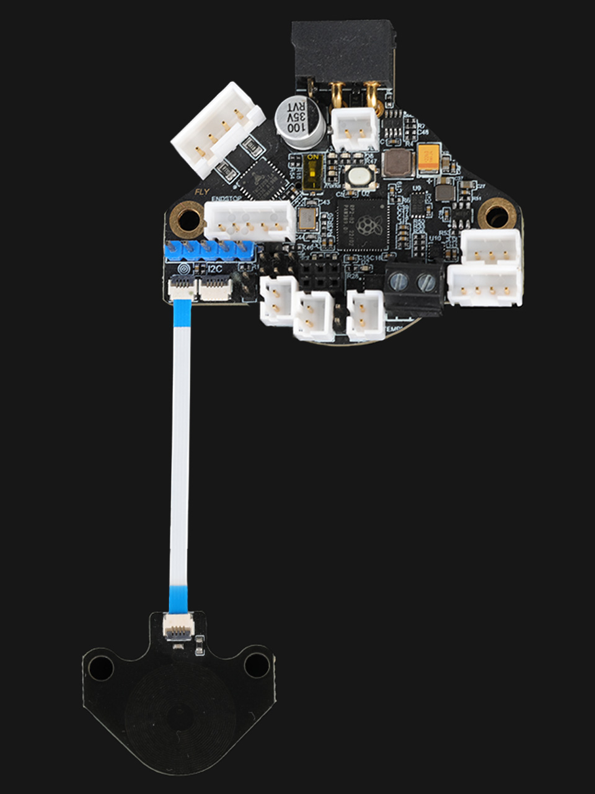

## 安装方法



**注意事项**

* 需要删除原来Klipper然后拉取分支才使用扫除
* 需要重新刷固件
* 删除klipper指令

```
rm -rf ~/klipper
```

* 拉取分支

```
git clone https://github.com/Arksine/klipper.git  -b dev-temperature-probe-20240507 klipper
```

* 拉取完成后重新刷固件即可
* 因网络问题可能会拉取失败，多拉取几次即可

## 使用板载1612参考配置

```
[temperature_probe my_probe]
sensor_type:Generic 3950
sensor_pin:SHT36:gpio28

[probe_eddy_current my_eddy_probe]
sensor_type: ldc1612
z_offset: 0.8
i2c_address: 43
i2c_mcu: SHT36
i2c_bus: i2c1e
x_offset: 0
y_offset: 0
speed:40
lift_speed: 5
```

## 使用外置1612参考配置

```
[temperature_probe my_probe]
sensor_type:Generic 3950
sensor_pin:SHT36:gpio28

[probe_eddy_current my_eddy_probe]
sensor_type: ldc1612
z_offset: 0.8
i2c_address: 42
i2c_mcu: SHT36
i2c_bus: i2c1e
x_offset: 0
y_offset: 0
speed:40
lift_speed: 5
```

##  操作说明
首先`SET_KINEMATIC_POSITION z=80` 
然后控制打印头到热床中央2cm高的位置,执行`LDC_CALIBRATE_DRIVE_CURRENT `执行并且稍等片刻后保存配置
在将喷嘴贴近PEI后执行`PROBE_EDDY_CURRENT_CALIBRATE CHIP=my_eddy_probe` 
此时校准步骤完成。 
整床扫描使用`BED_MESH_CALIBRATE METHOD=scan SCAN_MODE=rapid` 

## QGL使用扫描模式
```
[gcode_macro QUAD_GANTRY_LEVEL]   #随着龙门高低差降低降低探测高度
rename_existing: _QUAD_GANTRY_LEVEL
gcode:
    SAVE_GCODE_STATE NAME=STATE_QGL
    BED_MESH_CLEAR
    
      _QUAD_GANTRY_LEVEL horizontal_move_z=10 retry_tolerance=1
    
    _QUAD_GANTRY_LEVEL horizontal_move_z=2 METHOD=scan
    # G28 Z
    RESTORE_GCODE_STATE NAME=STATE_QGL
```
## z_tilt使用扫描模式
```
[gcode_macro Z_TILT_ADJUST]
rename_existing: _Z_TILT_ADJUST
gcode:
    SAVE_GCODE_STATE NAME=STATE_Z_TILT
    BED_MESH_CLEAR
    
      _Z_TILT_ADJUST horizontal_move_z=10 retry_tolerance=1
    
    _Z_TILT_ADJUST horizontal_move_z=2 METHOD=scan
    # G28 Z
    RESTORE_GCODE_STATE NAME=STATE_Z_TILT
```
## 温补校准

* 温补暂时用不了

```
PROBE_DRIFT_CALIBRATE COUNT=6 AUTOSTEP=7
```
