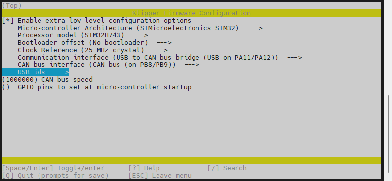
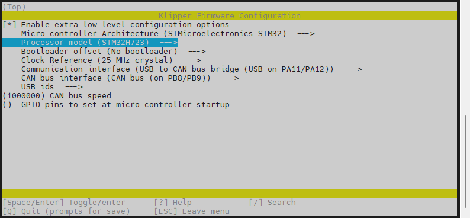

## 2. 固件烧录

Super8 Pro的Klipper固件配置如下图所示：

> [!TIP]
> 早期的 Super8pro 使用的主控芯片为`H743`，不带`pro`字样，后期带`pro`字样的使用的是`H723`芯片。编译固件前请仔细检查主控型号，避免编译烧录错误的固件！！！

<!-- tabs:start -->

### **H743USB固件**


### **H743CAN桥接固件**

>[!TIP]
>
>此方法是通过主板桥接CAN设备，请确保上位机的can0、桥接主板的CAN速率、CAN工具板的速率完全一致



### **H743CAN固件**

>[!TIP]
>
>此方法是通过主板CAN接口连接UTOC来寻找设备，请确保上位机的can0、桥接主板的CAN速率的速率完全一致


<!-- tabs:end -->


<!-- tabs:start -->

### **H723USB固件**


### **H723CAN桥接固件**

>[!TIP]
>
>此方法是通过主板桥接CAN设备，请确保上位机的can0、桥接主板的CAN速率、CAN工具板的速率完全一致



### **H723CAN固件**

>[!TIP]
>
>此方法是通过主板CAN接口连接UTOC来寻找设备，请确保上位机的can0、桥接主板的CAN速率的速率完全一致


<!-- tabs:end -->

## 2.1  编译Klipper固件

1. 请先阅读 [连接到SSH](/board/fly_pi/FLY_π_ssh "点击即可跳转") 文档
2. 连接到SSH后输入```cd ~/klipper/```回车
3. 按顺序执行下面的命令，输入命令后需要回车才会执行
4. ```make clean```
5. ```make menuconfig```
6. 现在应该出现了Klipper编译配置界面


* 上下键选择菜单，回车键确认或进入菜单
7. 进入菜单**Micro-controller Architecture**


8. 选择**STMicroelectronics STM32**回车


9. 进入菜单**Processor model**，按照下图所示配置信息进行配置


10. 配置完成后按```Q```键，出现**Save configuration**，这时再按```Y```键
* 现在应该保存了配置并且退出到了命令行界面

11. 输入```make -j4```开始编译，时间有点长

* 出现下图则编译成功


## 2.2  烧录固件到主板

> [!TIP]
> Super8 Pro需要插入BT0/3.3V跳线帽来进入DFU模式，进行USB烧录


> [!TIP]
> 注意：烧录成功后一定记得拔下来跳线帽


<!-- tabs:start -->

### **Klipper上位机烧录**

1. 安装烧录工具

```bash
sudo apt install dfu-util -y
```

2. 使用Type-C数据线将Super8 Pro板连接到Linux设备，请确保连接前已安装短接跳线
3. 执行下面的命令查看是否连接成功,复制蓝色框中的USB ID

```bash
lsusb
```


4. 烧录固件(烧录前确保已经编译过固件),将下面命令中的**0483:df11**替换为前面复制的USB ID

```bash
dfu-util -a 0 -d 0483:df11 --dfuse-address 0x08000000 -D ~/klipper/out/klipper.bin
```
5. 没有报错则烧录成功,如果出现报错请重新检查每个步骤操作


6. 出现上图内容则烧录成功

> [!TIP]
> 注意：烧录成功后一定记得拔下来跳线帽


* 使用软件**WinSCP**


* 第一次登录会出现确认弹窗，点击是或者直接回车即可
* 进入**klipper**文件夹


* 进入**out**文件夹


* 直接将**klipper.bin**拖拽到电脑桌面或其他文件夹即可


### **使用电脑USB烧录**

1. 下载烧录工具[STM32CubeProgrammer](https://cdn.mellow.klipper.cn/Utils/STM32CubeProgrammer.zip)
2. 解压烧录工具到任意目录，进入`STM32CubeProgrammer/bin`目录，双击打开`STM32CubeProgrammer.exe`
3. 将前面编译好的固件(klipper.bin)复制到电脑任意目录
4. 使用Type-C数据线将Super8 Pro板连接到电脑，请确保连接前已安装短接跳线
5. STM32CubeProgrammer中选择USB模式，并刷新，连接


6. 如果没有出现错误弹窗则连接成功
7. 打开固件文件，在弹窗中选择前面编译完成的固件文件(klipper.bin)


8. 确认页面有内容，不是00000。然后点击**Download**


9. 出现图中就是烧录成功


<!-- tabs:end -->

>[!TIP]
>注意：烧录成功后一定记得拔下来跳线帽
