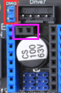

# 无限位归位注意事项

> [!Warning]
>
> 使用Klipper配置无限位归零，可能会对机器造成不可逆伤害，本文不对由此造成的损失负责


> [!Tip]
>
> 使用无限位之前最好将机器归位调整到正常状态！！！

## 1. 硬件检查

1. 检查驱动是否支持无限位或者是否有**DIAG引脚**，如果不支持或者没有则需要换驱动，不清楚可以查看[FLY-TMC驱动](http://mellow.klipper.cn/#/board/fly_tmc/)
2. 检查主板是否支持无限位，主板上有DIAG跳线引脚（红色框）与驱动的DIAG引脚（紫色框）才可以使用无限位功能。部分FLY主板是无需DIAG跳线即可使用无限位功能。



## 2. Klipper配置

1. 将对应的驱动设置虚拟限位，需要将 **[stepper_x]** 里面的 **endstop_pin**设置成如下配置。
2. 使用什么驱动就添加什么配置
3. **homing_retract_dist: 0**是后撤距离需要改零否则**会到归位后再次触发限位报错**

```cfg
[stepper_x]
endstop_pin:tmc2209_stepper_x:virtual_endstop
endstop_pin:tmc2240_stepper_x:virtual_endstop
endstop_pin:tmc5160_stepper_x:virtual_endstop
homing_retract_dist: 0
```

3. 驱动设置，以TMC5160为例

```cfg
[tmc5160 stepper_x]
sense_resistor: 0.075
diag1_pin: ^!PF3 
driver_SGT: 1
```
4. 需要注意采样电阻。TMC5160采样电阻是需要按自己判断然后修改**sense_resistor**否则会导致无限位使用失败,
5. DIAG引脚是主板对应限位引脚，如果配置错误则会导致归位一直失败，而且对应的限位口不能外接任何东西否则会导致归位不正常
6. **driver_SGT**是灵敏度需要一点点调整才可以正常使用。
7. TMC5160与TMC2240数值是在1之间需要0、1、2去测试
8. TMC2209数值是在20-120之间每次调整加5或者减5即可
9. 无限位使用回退与设置电流参考文档[无限位配置方法与宏](http://mellow.klipper.cn/#/board/fly_tmc/cfg)

