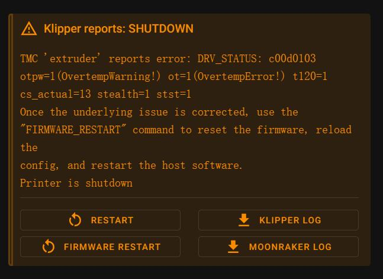

# 驱动常见问题

# **Unable to read tmc uart 'stepper_x' register IFCNT** 或者 **Unable to read tmc spi 'stepper_x' register register** 的错误？

## 1. 报错信息

## 2. 报错原因

无法与驱动通讯

## 3. 解决方法

1. 检查配置是否正确
2. 检查驱动跳线是否正确
3. 检查驱动供电是否正常
4. 更换到其他驱动口并且重新配置
5. 更换驱动判断
6. 如果驱动是问题请直接更换驱动

# TMC 'extruder' reports error: DRV_STATUS: c00d0103 otpw=1(OvertempWarning!) 

## 1. 报错信息

## 2. 报错原因

电机驱动器禁用了自己，因为它太热了

## 3. 解决方法

1. 降低电流
2. 添加风扇散热

# 其他常见问题

## TMC 报告错误： `... ot=1(OvertempError!)`[¶](https://www.klipper3d.org/zh/TMC_Drivers.html#tmc-ot1overtemperror)

这表明电机驱动器因温度过高而自我禁用。典型的解决方案是降低步进电机的电流，增加步进电机驱动器的冷却，和/或增加步进电机的冷却。

## TMC 报告错误：`... ShortToGND`（接地短路）或 `ShortToSupply`（与电源短路）

这表明驱动器已自行禁用，因为它检测到通过驱动器的电流非常高。这可能表明连接到步进电机或者部件电机内部的电线松动或短路了。

如果使用stealthChop模式，并且TMC驱动器不能准确地预测电机的机械负载，也可能发生这种错误。(如果驱动器预测不准确，那么它可能输出过高电流到电机，并触发自己的过电流检测)。要测试这个，请禁用stealthChop模式，再检查错误是否继续发生。

## TMC报告错误：`... reset=1(Reset)` 或`CS_ACTUAL=0(Reset?)` 或`SE=0(Reset?)`

这表明驱动器在打印过程中自我复位。这可能是由于电压或接线问题导致的。

## TMC 报告错误： `... uv_cp=1(Undervoltage!)`

这表明驱动器检测到了一个电压低事件，并已自行禁用。这可能是由于接线或电源问题导致的。