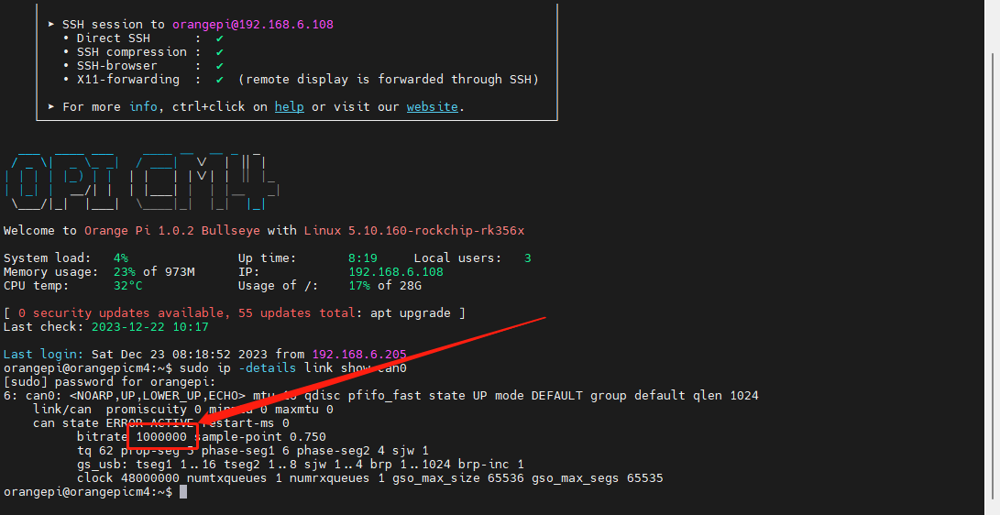

# 如何搜索ID并且将ID配置到Klipper

请使用MobaXterm_Personal等SSH工具连接通过WIFI到您的上位机，并且需要确定以下几点

1. 请确保上位机安装好了Klipper固件
2. 请确保登录的用户必须是安装好Klipper的用户
3. 请确保你的输入法是英文
4. 请确保你的上位机可以正常搜索到设备
5. 请确保以上注意事项都做到，否则无法进行下一步
6. 请确保下位机连接上位机的数据线具有数据传输功能

如何连接[连接到 SSH](http://mellow.klipper.cn/#/introduction/conntossh)

# 确定上位机是否连接到下位机

* SSH连接连接到上位机后输入`lsusb`并且回车，将可能出现下面几种设备
* 请确保下位机连接上位机的数据线具有数据传输功能
* 如果系统不支持`lsusb`可以执行下方指令进行安装
* 如果`lsusb`后没有设备，请更换上位机！

```
sudo apt-get install usbutils
```


`1d50:614e`属于USB固件是你的下位机刷了正确的USB固件才会显示，如果刷错固件或者未刷固件则不会显示设或者显示其他设备。

`1d50:606f` 属于CAN固件是你的下位机刷了CAN桥接固件或者接了UTOC才会显示，如果刷错固件或者未刷固件则不会显示设备或者显示其他设备。

* 如果有多个CAN设备建议都接到UTOC上否则会多个CAN设备，这会导致连接和配置容易出问题

如果没有这两个设备有以下几种可能

* 下位机没刷固件或者刷错固件
* 使用的数据线可能没有数据传输功能
* 上位机USB口故障
* FLY主板，例如：双子座系列,C8系列需要打开拨码才可以连接到上位机
* 接错线导致下位机进入短路保护模式，请注意建议将下位机的全部外设拆除限位，风扇，驱动等等！！！
* 如果是STM32主控下位机处于DFU模式，请将DFU跳线去除后重新给下位机通电
* 如果是RP2040主控下位机处于RP2 BOOT模式，请将BOOT跳线去除后重新给下位机通电
* **系统问题导致显示不全，如果有`1d50:606f`则为can设备，如果有`1d50:614e`则为STM32主控设备**

# 搜索设备ID

* 请注意USB固件只能使用USB的搜索方式，是无法搜索到CAN ID
* 请注意CAN固件只能使用CAN的搜索方式，是无法搜索到USB ID

## 搜索USB固件ID

查找 USB固件ID 的一般方法是从主机上的 ssh 终端运行此指令

```bash
ls /dev/serial/by-id/*
```

它会输出以下类似于内容：


* 请注意输出的ID必须带有`usb-Klipper`否则可能是其他固件的ID，可能无法使用！！

在上述命令中找到的名称是稳定的，可以在配置文件中使用它，配置方法请看最下方

## 搜索CAN固件ID

* 以UTOC和刷了CAN桥接固件的主板为例
* 请在完全断电情况下，将CAN的H与CAN的L接好使用万用表量CAN的H与L阻值
* 如果两端120R跳线都接上阻值应该在60左右
* 请确保UTOC或者CAN桥接固件的主板是已经连接到上位机，输入`lsusb`后有输出以下内容
* 系统问题导致显示不全，如果有`1d50:606f`则为can设备

```
OpenMoko, Inc. Geschwister Schneider CAN adapter
```


搜索CAN的ID之前请确保以下几点

* CAN速率是否一致，请确保上位机的CAN速率与下位机固件的CAN速率要一致
* 请在完全断电情况下，CAN的H与L的阻值应该在60左右

非FLY上位机的，请注意检查自己烧录的镜像内核是否支持CAN，如果不支持则无法使用CAN。检测方法如下。

在SSH输入：

```bash
sudo modprobe can && echo "您的内核支持CAN" || echo "您的内核不支持CAN"
```

输入以上指令后，如果您的内核支持CAN就会返回：``您的内核支持CAN``；如果不支持就会返回：``您的内核不支持CAN``。

### 非FLY上位机需要创建CAN配置

* FLY上位机默认带can0配置无需在创建此配置

```bash
sudo /bin/sh -c "cat > /etc/network/interfaces.d/can0" << EOF
allow-hotplug can0
iface can0 can static
    bitrate 1000000
    up ifconfig $IFACE txqueuelen 1024
    pre-up ip link set can0 type can bitrate 1000000
    pre-up ip link set can0 txqueuelen 1024
EOF
```

### 上位机CAN速率查询方法

上位机连接SSH后输入`sudo ip -details link show can0`回车输入你上位机的密码，将输出以下内容

* 下图圈起来的地方为上位机CAN速率



### 搜索CAN固件的ID

查找 CANID的一般方法是从主机上的 ssh 终端运行此指令

```bash
~/klippy-env/bin/python ~/klipper/scripts/canbus_query.py can0
```


以下几种情况可能导致无法搜索到CANID

* Klipper之前连接过CAN设备，可以将配置里面的ID屏蔽后彻底断电重启
* UTOC使用typec供电足够，但是刷了CAN桥接固件的主板可能需要将`电源口接上电源`才可以搜索到ID
* CAN速率不一致
* CAN的H与L阻值不在60R左右
* 上位机不支持CAN
* 下位机没刷对固件
* 非FLY上位机的，请注意检查自己烧录的镜像内核是否支持CAN，如果不支持则无法使用CAN。检测方法如下。

在SSH输入：

```bash
sudo modprobe can && echo "您的内核支持CAN" || echo "您的内核不支持CAN"
```

# Klipper配置ID方法

* 在浏览器中输入上位机的IP,然后打开配置找到并且打开`printer.cfg`

## USBID配置方法

找到`[mcu]`将搜索到的ID填写到`[mcu]`下面

```
[mcu]
serial: /dev/serial/by-id/usb-Klipper_stm32H743xx_500025000151323032333133-if00
```

## CANID配置方法

```
[mcu]
canbus_uuid: c5d882c0d121
```

## 多个MCU配置方法

注意事项

* 主MCU得配置一个`[mcu]`，其他的MCU配置需要添加`[mcu SHT36V3]`其中的SHT36V3是你指定的MCU名字这是可以更改的！！

```
[mcu]
serial: /dev/serial/by-id/usb-Klipper_stm32H743xx_500025000151323032333133-if00

[mcu SHT36]
canbus_uuid: c5d882c0d121
```

* 调用其他MCU引脚方法，以`[probe]`配置为例
* 这样是默认调用主MCU的PB0端口

```
[probe]
pin: PB0
x_offset: 0
y_offset: 25.0
z_offset: 0
speed: 10.0
samples: 3
samples_result: median
sample_retract_dist: 4.0
samples_tolerance: 0.010
samples_tolerance_retries: 3
```

* 如果需要调用工具板的端口则需要在`pin:`的后面添加其他MCU名字并且修改你需要使用的引脚号，下方是示例配置
* 这样写就可以告诉klipper，我需要调用`SHT36的`gpio22`端口，其他配置同理
* 如果`probe`出现反转（触发时报告“打开”，反之亦然），则在端号定义中添加一个“！”（例如，“pin: !^SHT36:gpio22”），或者如果已经存在“！”，则删除该“！”。
* 如果限位状态根本没有变化，则通常表示限位器连接到不同的引脚。 但是，它也可能表示需要更改引脚的上拉设置（pin 名称开头的“^” - 大多数打印机需要使用上拉电阻并且应该存在“^”）。
* 请注意配置无法重复使用，如果想使用工具板连接挤出机就需要将主板的配置屏蔽或者修改

```
[probe]
pin: ^SHT36:gpio22
x_offset: 0
y_offset: 25.0
z_offset: 0
speed: 10.0
samples: 3
samples_result: median
sample_retract_dist: 4.0
samples_tolerance: 0.010
samples_tolerance_retries: 3
```

